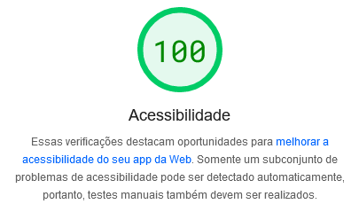

# Ricardo Alves - website pessoal

[🌐 Website pessoal](https://ricardospalves.github.io)

## 🗣️ Sobre o projeto

Neste projeto foquei em um design minimalista, primeiro porque não sou um bom designer (😂) e segundo porque queria passar as informações de forma clara, objetiva e sem distrações. Isso ajudou a manter a estrutura do website mais consistente e uniforme.

Outra preocupação foi com a acessibilidade, então as cores usadas foram testadas e todas possuem o nível [WCAG AAA](https://www.w3.org/WAI/WCAG2AA-Conformance), que é o nível mais alto. Isso quer dizer que os textos, links e elementos de interação da página possuem um alto contraste em relação a cor de fundo. Isso facilita na leitura e interação do usuário. Além das cores, as fontes e elementos de interação estão em tamanhos adequados.

A acessibilidade atingiu a nota máxima nos testes do [_Lighthouse_](https://developer.chrome.com/docs/lighthouse/overview/), tanto no _desktop_ quanto no _mobile_, como pode ser conferido nos links abaixo:

- [📱 Análise para o mobile](https://pagespeed.web.dev/analysis/https-ricardospalves-github-io/5rz6xajg37?form_factor=mobile)
- [🖥️ Análise para o desktop](https://pagespeed.web.dev/analysis/https-ricardospalves-github-io/5rz6xajg37?form_factor=desktop)

## ✨ Tecnologias

- React com TypeScript (JavaScript)
- Next.js
- CSS (Tailwind)
- HTML

## 📝 Licença

Esse projeto é open source e foi lançado sob a [licença MIT](https://github.com/ricardospalves/ricardospalves.github.io/blob/main/LICENSE).
